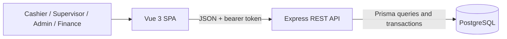
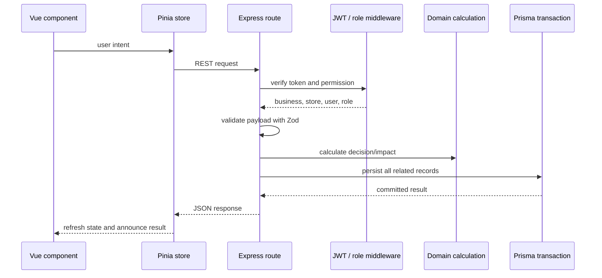
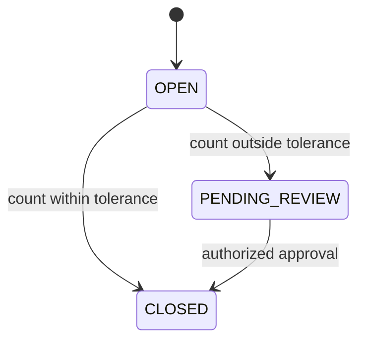
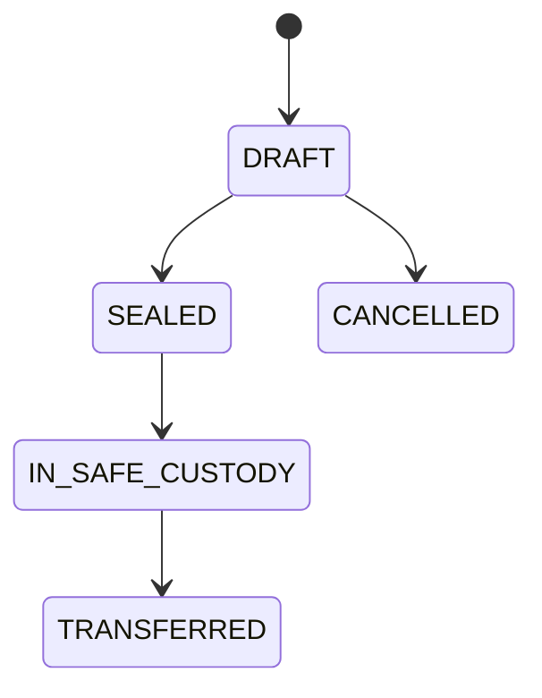
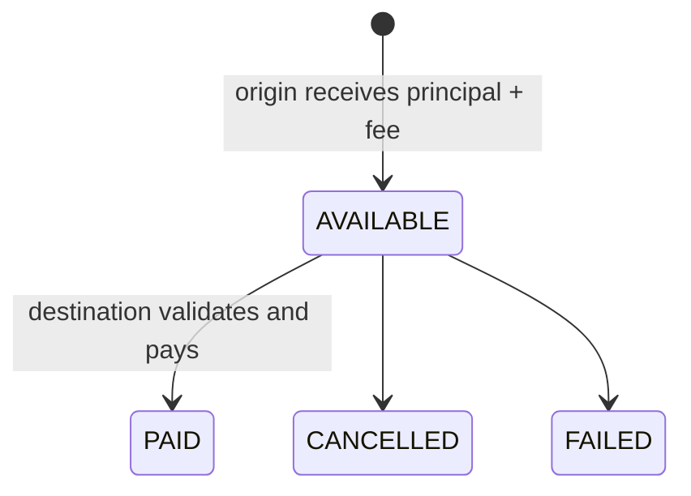
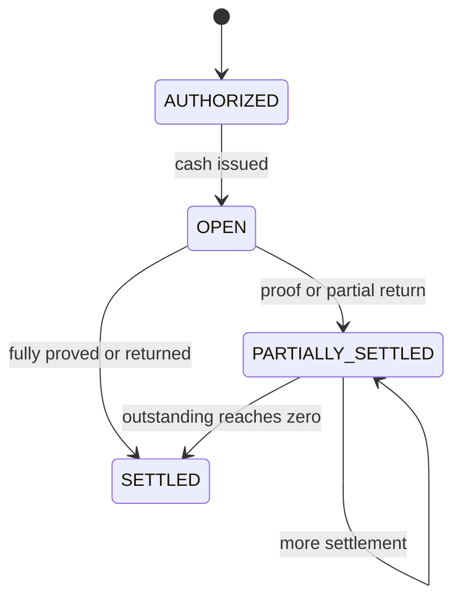

# PosFlow architecture and technical decisions

This document describes the implemented portfolio release. It separates current
behavior from production hardening that would be required for a real financial
operation.

## Architectural goals

PosFlow is optimized for five qualities:

1. **Monetary correctness.** A failed workflow must not leave inventory, cash, or
   status records partially updated.
2. **Traceability.** Sensitive changes retain the actor, time, source record, and
   resulting financial impact.
3. **Authorization at the source of truth.** Hiding a button improves the
   experience; it is never the security boundary.
4. **Explainable totals.** Expected cash is reconstructed from ledger entries
   instead of a manually editable balance.
5. **Portfolio-sized deployability.** A modular monolith keeps the domain easy to
   run and inspect without pretending that this MVP needs distributed services.

## System context



The project is an npm workspace:

- `apps/web` contains the Vue application, Pinia stores, API client, feature
  panels, styling, and frontend logic tests.
- `apps/api` contains the HTTP layer, authentication middleware, pure domain
  calculations, Prisma access, migrations, seeds, and backend tests.
- `e2e` contains browser journeys and a database fixture isolated from the demo
  schema.

## Request lifecycle



The API never accepts `businessId`, role, or trusted store scope from request
bodies. Those values come from the verified token. A cashier's own-shift checks
and a supervisor's register delegation are evaluated again inside the route.

## Module boundaries

### Frontend

`App.vue` is the application shell and role-aware router for the compact MVP.
It chooses the visible operational panel and coordinates Pinia actions. Feature
components own form state and emit validated user intentions; they do not write
directly to PostgreSQL or calculate authoritative balances.

The session store owns the demo identity and bearer token. The operations store
loads server state and exposes typed actions for shifts, sales, bundles,
remittances, advances, settings, reports, and finance.

### Backend

The HTTP layer is organized by resource:

- authentication;
- catalog and register settings;
- shifts and reconciliation reports;
- sales and cash bundles;
- remittances and funding;
- advances and settlements;
- consolidated finance.

Small pure functions under `src/domain` encode calculations that can be tested
without a database. Routes combine those decisions with authorization and
transactional persistence.

### Database

PostgreSQL is the source of truth. Prisma supplies a typed relational model,
versioned migrations, explicit transactions, relation constraints, compound
uniqueness, and indexes for the operational queries.

## Core technical decisions

### ADR-001 — Store money as integer cents

All persisted and calculated monetary values are integers ending in `Cents`.
For example, MXN 189.00 is stored as `18900`. Floating-point arithmetic is not
used for business totals.

**Why:** decimal display values such as `0.1 + 0.2` are unsafe as binary
floating-point money. Integer arithmetic keeps equality and reconciliation
deterministic for this single-currency MVP.

### ADR-002 — Derive expected cash from an append-oriented ledger

Expected drawer cash is the sum of the shift's `LedgerEntry.amountCents`.
Opening, sale, remittance, advance, return, and bundle records provide the
business detail; the ledger provides one explainable cash impact per event.

**Why:** an editable balance would describe only the current number. A ledger
also explains how the number was reached and supports reconciliation reports.

### ADR-003 — Separate physical cash from remittance funding

`LedgerEntry` represents money physically entering or leaving a drawer.
`FundingEntry` represents what a store and the fictional remittance network
must compensate between them.

**Why:** receiving a remittance increases physical cash but creates a funding
obligation. Paying one reduces cash but creates a right to settlement. Adding
both concepts into one balance would double-count or mislabel money.

### ADR-004 — Preserve original counts and sealed records

A cash bundle becomes immutable after sealing. A close outside tolerance first
moves to `PENDING_REVIEW`; approval records the approver without modifying the
submitted denomination count or discrepancy.

**Why:** review should authorize an explained exception, not erase the evidence
that triggered it.

### ADR-005 — Enforce permissions in the API

The frontend renders only allowed navigation and actions. The API independently
checks JWT role, business, optional store, shift ownership, and administrator
delegation.

**Why:** browser controls are user experience, not access control. A crafted HTTP
request must receive the same rejection as an unavailable UI action.

### ADR-006 — Make multi-record workflows atomic

Sales update stock, receipt sequence, sale rows, payment, cash ledger, and audit
inside a serializable transaction. Shift opening/closing, bundle sealing,
remittance send/pay, and advance changes also group dependent writes.

**Why:** any partial result would make later cash and inventory reports
untrustworthy.

### ADR-007 — Use conditional writes for race-sensitive state

Remittance payout claims only a row still in `AVAILABLE`. Advances carry a
`version` and update only when the caller observed the current version and
state.

**Why:** two operators can read the same available record. Conditional updates
ensure only one wins; the other receives a conflict rather than duplicating a
payment or settlement.

### ADR-008 — Keep the portfolio release a modular monolith

The API is one deployable process with one relational database.

**Why:** the current scale benefits more from simple transactions, local
debugging, and cohesive domain boundaries than from queues, distributed
transactions, or independently deployed services. The modules can be separated
later if load or ownership creates a real need.

## State machines

### Shift



### Cash bundle



The current UI implements creation, draft editing, and sealing. Later custody
states exist in the model as explicit extension points.

### Remittance



The functional demo implements `AVAILABLE → PAID`. Cancellation and failure
are modeled but intentionally do not have MVP mutation routes.

### Advance



## Authorization model

| Boundary | Enforcement |
| --- | --- |
| Business | `businessId` is read from the signed token and included in protected queries. |
| Store | Store-bound users receive a `storeId`; operational queries and mutations restrict relations to it. |
| Role | `requireRole` rejects unsupported roles before a mutation executes. |
| Shift ownership | Cashiers may sell, issue/return advances, operate remittances, and close only their own shift. |
| Delegation | A supervisor may manage bundles or approve discrepancies only when the target register enables that capability. |
| State | Routes require the correct current status, such as `OPEN`, `DRAFT`, `AVAILABLE`, or `PENDING_REVIEW`. |

## Error contract

Expected failures use an HTTP status plus a stable machine code:

```json
{
  "error": {
    "code": "CASH_LIMIT_REACHED",
    "message": "La venta rebasa el límite de efectivo del cajón.",
    "details": {
      "expectedCashCents": 490000,
      "projectedCashCents": 515000,
      "cashLimitCents": 500000
    }
  }
}
```

The API uses `400` for malformed route/query identifiers, `401` for invalid
sessions, `403` for authorization, `404` for scoped missing records, `409`
for business/state conflicts, and `422` for invalid payloads or domain values.
Unexpected errors return a generic `500` response.

## Accessibility and responsive architecture

- Native landmarks, headings, form labels, tables, fieldsets, and status regions
  expose document structure.
- The main navigation marks the current view; remittance tabs use tab semantics
  and arrow-key navigation.
- Focus moves to the new main view after role or page changes, while a skip link
  remains the first keyboard target on initial load.
- Wide data tables scroll inside their own container instead of expanding the
  page.
- The application is tested at 320 px, 375 px, 768 px, and desktop widths.
- Reduced-motion preferences disable non-essential transition duration.

## Security baseline and known tradeoffs

Implemented:

- bcrypt password hashes;
- signed two-hour JWT access tokens;
- configured single-origin CORS;
- a 100 KB JSON body limit;
- strict input validation;
- business/store/role authorization;
- generic unexpected-error responses;
- transactional audit records for sensitive operational events.

Deliberate demo tradeoffs:

- The role picker uses known fictional credentials.
- The bearer token is stored in `localStorage`.
- There is no refresh-token flow, rate limiting, MFA, centralized log pipeline,
  or external identity provider.

A production implementation should use managed identity or secure
`HttpOnly`/same-site sessions, CSRF protection where applicable, secret
rotation, rate limiting, observability, backups, retention policies, and a
security review appropriate to the payment/remittance provider.

## Deployment shape

The application is ready to be deployed as three resources:

1. a static Vite frontend;
2. a Node.js API service;
3. a managed PostgreSQL database.

The repository packages the API and frontend as separate production containers,
provides a PostgreSQL Compose stack for reproducible local execution, and runs a
GitHub Actions quality gate on every push and pull request. Hosted secrets,
health monitoring, and Render continuous delivery are completed when the public
portfolio environment is provisioned.
