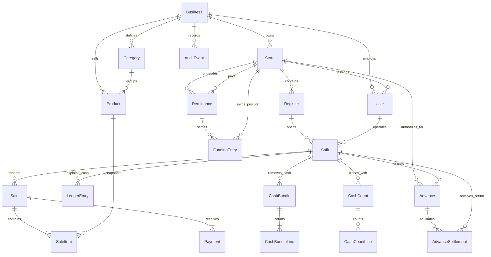

# PosFlow relational data model

The relational model separates commercial records, physical cash, custody,
network funding, accountability, and audit history. The full schema is in
`apps/api/prisma/schema.prisma`.

## Relationship overview



## Ownership hierarchy

`Business` is the top-level isolation boundary. The demo seeds one fictional
business, but protected records carry or inherit its identifier so API queries
can prevent cross-business access.

```text
Business
├─ Store
│  ├─ Register
│  │  └─ Shift
│  ├─ store-bound User
│  ├─ Remittance origin/destination
│  ├─ FundingEntry
│  └─ Advance
├─ global User
├─ Category
├─ Product
└─ AuditEvent
```

## Model responsibilities and invariants

| Model | Responsibility | Important invariant |
| --- | --- | --- |
| `Business` | Tenant/business boundary | `slug` is globally unique. |
| `Store` | Operational location | `code` is unique inside a business. |
| `Register` | Configurable cash point | `code` is unique inside a store; cash limit and tolerance belong to the register. |
| `User` | Authenticated actor and role | Email is unique; optional store limits operational scope. |
| `Category` | Product grouping | Name is unique inside a business. |
| `Product` | Sellable item and current stock | SKU is unique inside a business; prices are integer cents. |
| `Shift` | One register operating session | Only `OPEN` and `PENDING_REVIEW` are active; route logic prevents a second active shift per register. |
| `Sale` | Completed commercial transaction | Receipt number is unique inside a business. |
| `SaleItem` | Product line at sale time | Name, SKU, and price snapshots preserve historical meaning. |
| `Payment` | Tender recorded for a sale | Current sale workflow writes one cash payment equal to the sale total. |
| `LedgerEntry` | Signed physical-cash impact | Every row belongs to a shift and points to a source type/id. |
| `CashBundle` | Counted cash removed to custody | Reference is unique per business; sealed bundles cannot be edited. |
| `CashBundleLine` | Denomination count | One row per denomination inside a bundle. |
| `CashCount` | Submitted blind count | One closing count per shift. |
| `CashCountLine` | Closing denominations | One row per denomination inside a count. |
| `Remittance` | Cross-store send/payout lifecycle | Reference is unique per business; payout can claim an available row once. |
| `FundingEntry` | Store/network compensation position | Principal settlement remains separate from physical cash. |
| `Advance` | Authorized operational accountability | `proofCents + returnedCents <= amountCents`; version supports optimistic concurrency. |
| `AdvanceSettlement` | Expense proof or cash return | A cash return may link to the receiving shift; a proof has no drawer movement. |
| `AuditEvent` | Who did what and when | Actor and entity identity are retained with optional structured metadata. |

## Monetary representation

All money fields use integer cents:

- `priceCents`
- `amountCents`
- `openingFloatCents`
- `expectedCashCents`
- `countedCashCents`
- `discrepancyCents`
- `feeCents`
- `proofCents`
- `returnedCents`

Signed ledger amounts describe direction:

| Event | Physical ledger sign |
| --- | ---: |
| Opening float | Positive |
| Cash sale | Positive |
| Remittance sent | Positive principal + fee |
| Remittance paid | Negative principal |
| Advance issued | Negative |
| Advance cash returned | Positive |
| Cash bundle sealed | Negative |

The expected drawer amount is calculated from the ledger rather than trusted from
a browser or incrementally edited balance.

## Historical snapshots

`SaleItem` stores product name, SKU, and unit price snapshots in addition to the
product relation. If an administrator later renames or reprices a product, the
completed receipt still describes what was sold.

Shift close values are persisted after calculation so the submitted expected,
counted, and discrepancy values remain available for review and reporting.
Approving a discrepancy adds the approver and closed timestamp; it does not
overwrite the original count.

## Physical cash and custody

`LedgerEntry` answers: **how much cash should be in this drawer?**

`CashBundle` answers: **how much counted cash left the drawer and entered
controlled custody?**

Sealing creates both the immutable bundle state and a negative ledger entry in
one transaction. The finance overview then counts sealed/in-custody bundles as
controlled cash outside active drawers.

## Remittance funding

`Remittance` links an origin store, destination store, principal, fee, send
actor/shift, and optional payout actor/shift.

`FundingEntry` is intentionally separate:

- send: `-principal` for the origin's obligation;
- payout: `+principal` for the destination's settlement right.

The commission exists only on the send record and physical drawer entry. It is
not added to the funding principal.

## Advance accountability

An advance starts as an authorization with no drawer impact. Issuing it links the
advance to a shift, changes its state, and writes a negative cash entry.

Settlements are append-only child rows:

- `EXPENSE_PROOF` reduces responsibility without changing cash;
- `CASH_RETURN` reduces responsibility and writes positive cash into the shift
  that receives it.

The parent stores aggregate proof and return totals for efficient status and
dashboard queries. A versioned conditional update prevents two stale settlements
from exceeding the remaining amount.

## Constraints and indexes

Compound unique constraints protect business identifiers such as store code,
register code, category name, product SKU, receipt number, remittance reference,
and advance reference.

Indexes support the main access paths:

- business + role;
- store assignment;
- register/shift status;
- shift ledger history;
- business + ledger type;
- remittance status and destination;
- advance status/due date and store;
- audit chronology and entity lookup.

Foreign-key delete behavior is restrictive for completed financial records.
`Cascade` is used mainly for tenant-owned setup data and line items whose parent
is their complete meaning. Actor references generally use `Restrict` or
`SetNull` so history is not silently destroyed.

## Modeled extension points

The schema includes states that are not mutated by the current UI:

- cash bundle custody and transfer;
- remittance cancellation and failure;
- sale refund/void status and card payment enum;
- funding adjustments.

They make future direction explicit, but the README does not claim those flows as
implemented MVP behavior.
